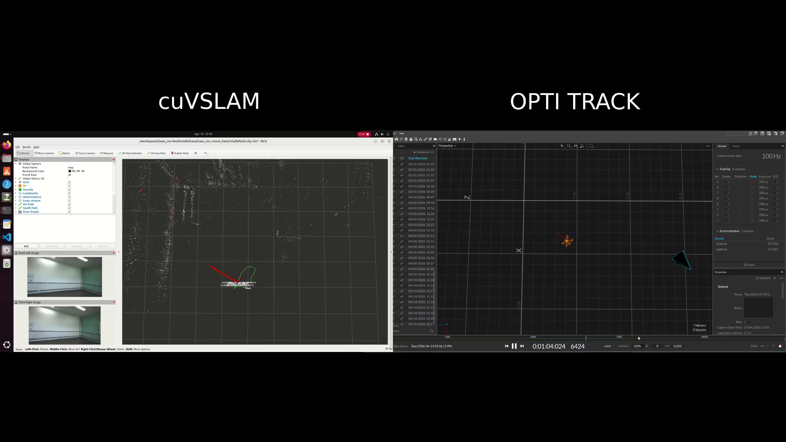
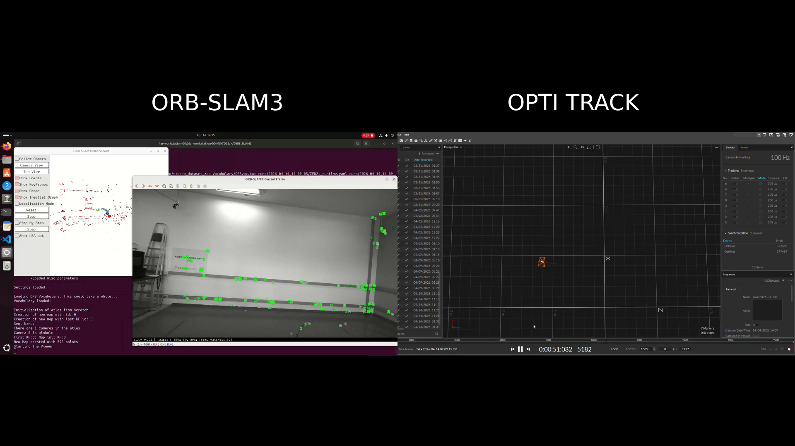

# Visual SLAM with ZED 2i: ORB-SLAM3 and CuVSLAM

This repository contains scripts, configuration files, and practical setup notes for stereo visual SLAM experiments with the ZED 2i camera using two methods: ORB-SLAM3 and CuVSLAM.

## [ORB-SLAM3](scripts/zed_orb_slam_3/README.md)

Scripts and instructions for using ORB-SLAM3 with the ZED 2i, including online execution with the camera and offline replay from recorded runs.

## [CuVSLAM](scripts/zed_cu_vslam/README.md)

Launch file and setup instructions for using CuVSLAM with the ZED 2i in the Isaac ROS ecosystem.

## Videos

### CuVSLAM + OptiTrack

### ORB-SLAM3 + OptiTrack

