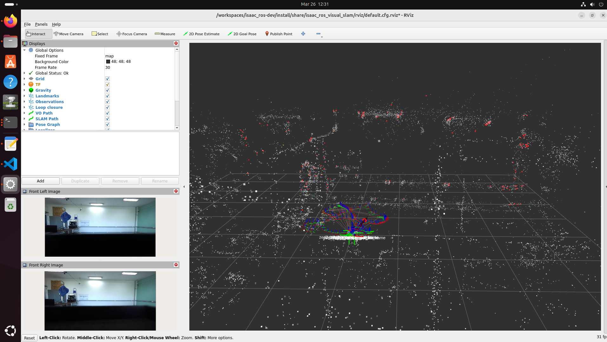

# CuVSLAM with ZED 2i

This folder contains a custom launch file for stereo visual SLAM with ZED 2i using NVIDIA Isaac ROS Visual SLAM.

## Prerequisites

- Isaac ROS 3.2, preferably in container
- ZED SDK
- `zed_wrapper`
- [ZED setup](https://nvidia-isaac-ros.github.io/v/release-3.2/getting_started/hardware_setup/sensors/zed_setup.html)
- [Isaac ROS setup](https://nvidia-isaac-ros.github.io/v/release-3.2/getting_started/index.html)
- [Isaac ROS Visual SLAM package](https://nvidia-isaac-ros.github.io/v/release-3.2/repositories_and_packages/isaac_ros_visual_slam/isaac_ros_visual_slam/index.html#quickstart)


## Custom launch file

Copy `zed_vslam.launch.py` to:

```text
isaac_ros_visual_slam/launch/
```

The launch file configures:

- rectified stereo images
- base frame `zed_camera_center`
- remappings for left/right rectified grayscale images and camera info

## To open a new terminal inside the Docker container:

```bash
cd ${ISAAC_ROS_WS}/src/isaac_ros_common && \
   ./scripts/run_dev.sh
```

## Run with ZED wrapper

First terminal:

```bash
ros2 launch zed_wrapper zed_camera.launch.py camera_model:=zed2i
```

Second terminal:

```bash
ros2 launch isaac_ros_visual_slam zed_vslam.launch.py
```

## Alternative NVIDIA example

```bash
sudo apt-get update
```

```bash
sudo apt-get install -y ros-humble-isaac-ros-examples ros-humble-isaac-ros-stereo-image-proc ros-humble-isaac-ros-zed
```

```bash
ros2 launch isaac_ros_examples isaac_ros_examples.launch.py \
launch_fragments:=zed_stereo_rect,visual_slam pub_frame_rate:=30.0 \
base_frame:=zed2_camera_center camera_optical_frames:="['zed2_left_camera_optical_frame', 'zed2_right_camera_optical_frame']" \
interface_specs_file:=${ISAAC_ROS_WS}/isaac_ros_assets/isaac_ros_visual_slam/zed2_quickstart_interface_specs.json
```

## Visualize with Rviz
   
```bash
rviz2 -d $(ros2 pkg prefix isaac_ros_visual_slam --share)/rviz/default.cfg.rviz
```


