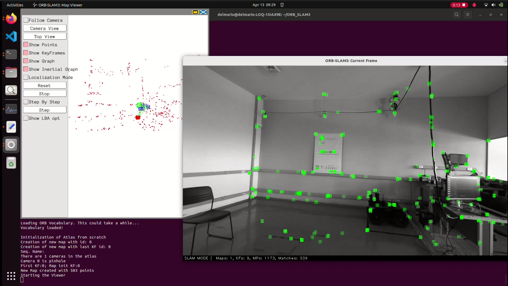

# ORB-SLAM3 with ZED 2i

This folder contains custom scripts and notes to run ORB-SLAM3 with the ZED 2i camera in stereo-only mode, including online capture and offline replay from recorded runs.

## Prerequisites

- Ubuntu 22.04 or 24.04
- Pangolin
- OpenCV >= 4.4
- Eigen3
- ZED SDK for online execution
- ORB-SLAM3 source code

## Clone ORB-SLAM3

Clone the repository and switch to the `c++14_comp` branch:

```bash
git clone https://github.com/UZ-SLAMLab/ORB_SLAM3.git
cd ORB_SLAM3
git checkout c++14_comp
```

## Required modification in `System.cc`

Disable the settings print to avoid the segmentation fault in the `Settings` output operator for rectified stereo mode:

```cpp
// cout << (*settings_) << endl;
cout << "Settings loaded." << endl;
```

## Add the custom scripts

Copy the files from this repository to:

```text
ORB_SLAM3/Examples/Stereo/
```

Files:

- `stereo_zed2i.cc`
- `stereo_dataset_zed.cc`
- `ZED2i.yaml`

## Update `CMakeLists.txt`

Add the custom executables to the Stereo examples section of ORB-SLAM3.

Example:

```cmake
add_executable(stereo_zed2i
        Examples/Stereo/stereo_zed2i.cc)
target_link_libraries(stereo_zed2i ${PROJECT_NAME})

add_executable(stereo_dataset_zed
        Examples/Stereo/stereo_dataset_zed.cc)
target_link_libraries(stereo_dataset_zed ${PROJECT_NAME})
```

If your `stereo_zed2i.cc` uses `std::filesystem`, it may also be necessary to force C++17 only for that target.

## Online execution with ZED 2i

```bash
./Examples/Stereo/stereo_zed2i Vocabulary/ORBvoc.txt Examples/Stereo/ZED2i.yaml
```

## Offline replay from recorded runs

```bash
./Examples/Stereo/stereo_dataset_zed Vocabulary/ORBvoc.txt runs/<run_name>/ZED2i_runtime.yaml runs/<run_name>
```



## Notes

- `stereo_zed2i.cc` generates a runtime YAML and stores run data.
- `stereo_dataset_zed.cc` replays an existing recorded run.
